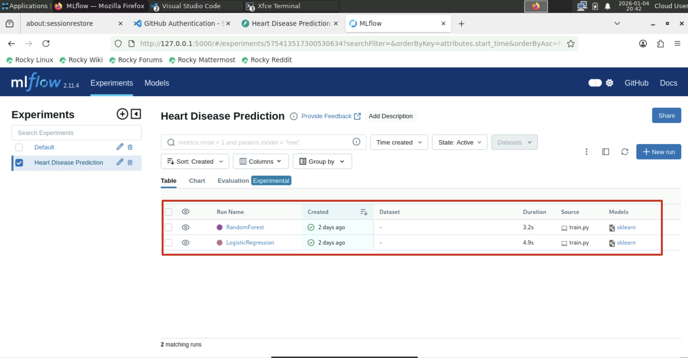
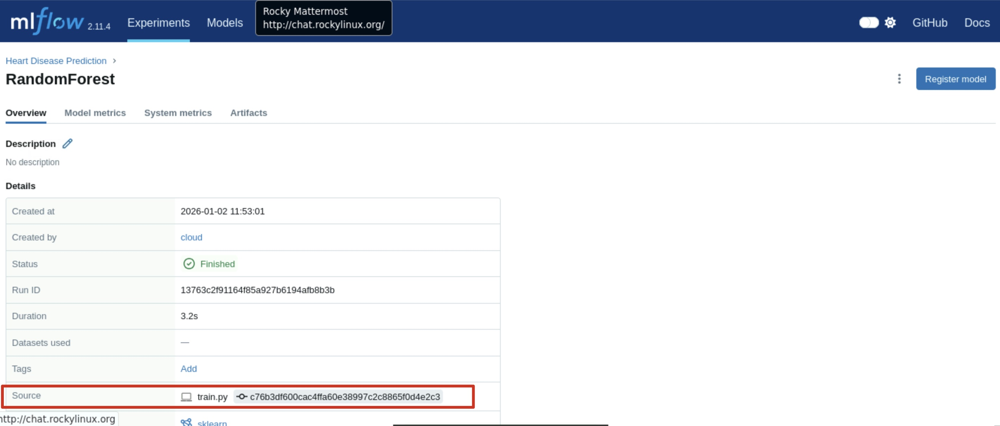
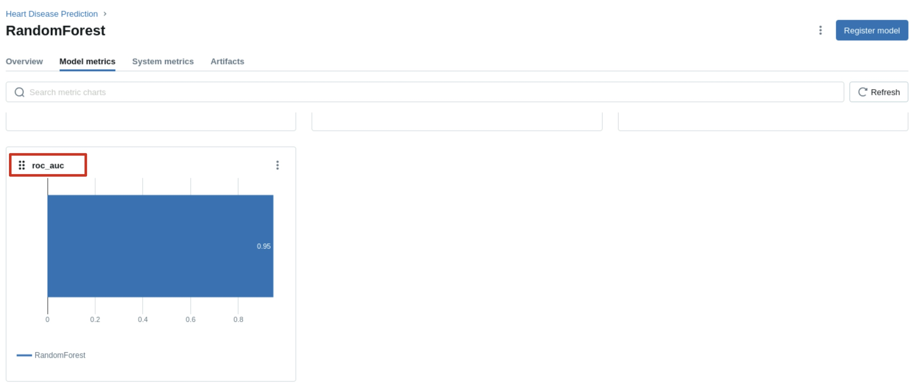
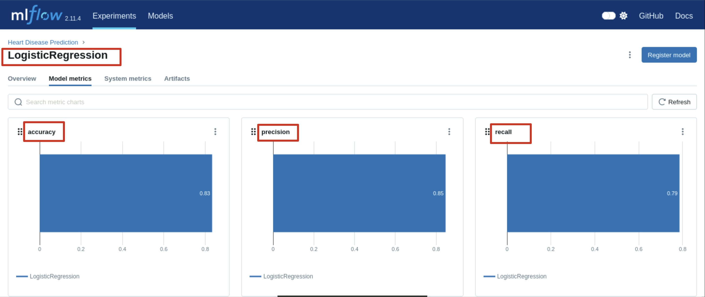
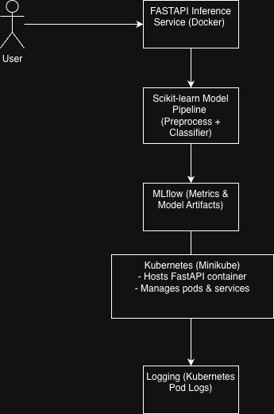
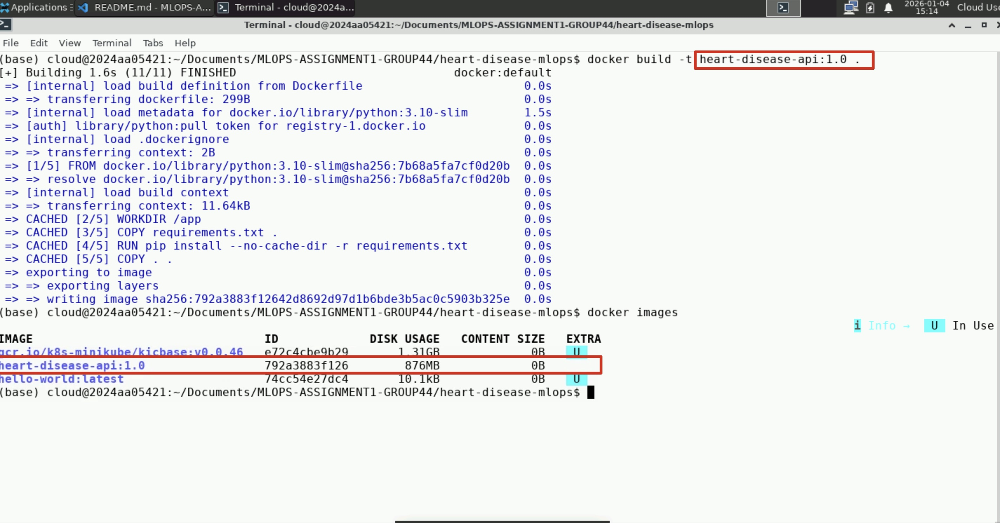
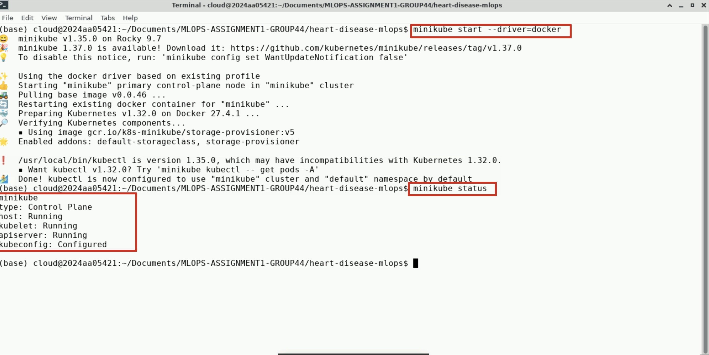
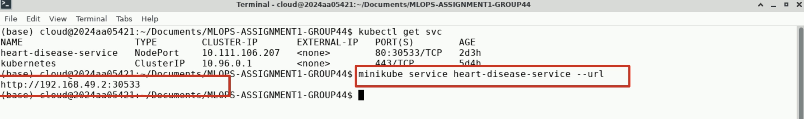
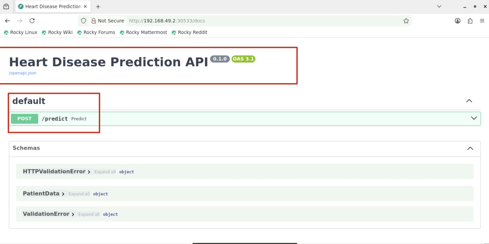
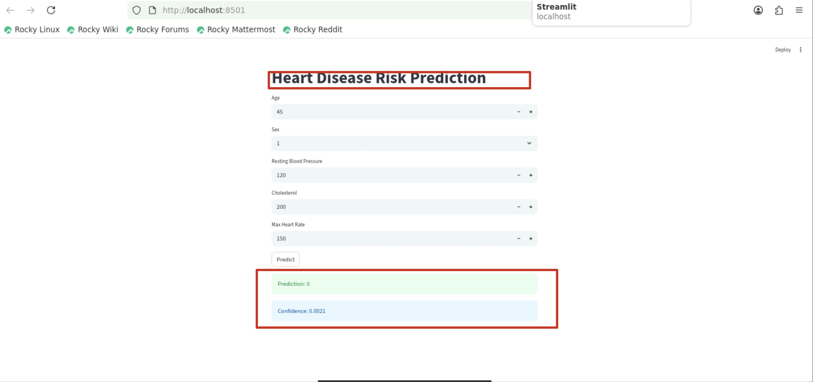

# Heart Disease Risk Prediction: An End-to-End MLOps Pipeline

| S.No | Register Number | Name                              | Contribution |
|------|-----------------|-----------------------------------|--------------|
| 1    | 2024aa05421     | Krithika Madhavan                 | 100%         |
| 2    | 2024aa05435     | Yarragondla Rugmangadha Reddy     | 100%         |
| 3    | 2024aa05423     | Payel Karmakar                    | 100%         |
| 4    | 2024aa05870     | Deepak Sindhu                     | 100%         |
| 5    | 2024ab05227     | PARAB PRATHAMESH PRAFULLA PRADNYA | 100%         |


## 1. Project Overview

- This project implements an end-to-end MLOps pipeline for predicting the presence of heart disease using patient health data. The objective is to design, build, and deploy a scalable and reproducible machine learning solution by applying modern MLOps practices across the entire model lifecycle.

- The solution uses the **Heart Disease UCI Dataset**, which contains clinical features such as age, sex, blood pressure, cholesterol levels, electrocardiographic results, and other medically relevant indicators. The target variable is binary, representing the presence or absence of heart disease.

- The project covers all major stages of an industrial machine learning workflow, including data acquisition and exploratory data analysis, feature engineering, model training and evaluation, experiment tracking, CI/CD automation, containerized model serving, deployment on Kubernetes, and runtime monitoring. Multiple classification models are trained and compared, with performance evaluated using standard metrics such as accuracy, precision, recall, and ROC-AUC.

- To ensure reproducibility and automation, **MLflow** is integrated for experiment tracking and artifact management, while **GitHub Actions** is used to implement a continuous integration pipeline that performs linting, testing, data preparation, and model training. The final trained model is exposed through a **FastAPI-based REST API**, containerized using Docker, and deployed on a Kubernetes cluster using **Minikube**. Request-level logging and latency monitoring are implemented to provide basic production observability.
    
- An optional **Streamlit-based user interface** was implemented as a lightweight demonstration layer to interact with the deployed FastAPI service. The Streamlit application collects user inputs and sends them to the `/predict` endpoint, displaying the predicted risk and confidence score without performing inference locally.

- Overall, this project demonstrates a complete, production-aligned MLOps workflow that mirrors real-world machine learning systems, emphasizing automation, reproducibility, deployment readiness, and monitoring.

## 2. Setup & Installation Instructions

This section describes the steps required to set up the project locally, execute model training, and deploy the model-serving API.

---

### 2.1 System Requirements

- Operating System: Linux / macOS / Windows
- Python Version: Python 3.10 or higher
- Package Manager: pip
- Containerization: Docker
- Orchestration: Minikube and kubectl
- Optional UI: Streamlit

---

### 2.2 Clone the Repository

```bash
git clone https://github.com/Krithika-Madhavan-5421/MLOPS-ASSIGNMENT1-GROUP44.git
cd heart-disease-mlops
```
---

### 2.3 Create and Activate a Conda Environment

A Conda environment is used to isolate project dependencies and ensure reproducibility across different systems.

Create a new Conda environment:

```bash
conda create -n heart-disease-mlops python=3.10 -y
```

--- 

### 2.4 Install Project Dependencies

Install all required Python dependencies using the provided requirements.txt file.

```bash
pip install --upgrade pip
pip install -r requirements.txt
```

---

### 2.5 Data Acquisition and Exploratory Data Analysis

The dataset is automatically fetched from the UCI Machine Learning Repository.

Run the EDA script:

```bash
python src/eda.py
```

This step:

- Downloads the Heart Disease UCI dataset

- Cleans and preprocesses the data

- Converts the target variable into a binary label

- Saves the cleaned dataset to data/heart.csv

- Generates EDA visualizations under artifacts/plots/

---

### 2.6 Model Training and Experiment Tracking

Train the machine learning models using the training script:

```bash
python src/train.py
```
This step:

- Loads the cleaned dataset

- Applies feature preprocessing using a unified pipeline

- Trains Logistic Regression and Random Forest models

- Evaluates models using accuracy, precision, recall, and ROC-AUC

- Logs metrics and model artifacts using MLflow

To view experiments and metrics:
```bash
mlflow ui
```
Access the MLflow dashboard at:
```bash
http://localhost:5000
```

---

### 2.7 Running the FastAPI Inference Service Locally

The trained model is served through a FastAPI-based REST API.
```bash
uvicorn src.app:app --host 0.0.0.0 --port 8000
```

Swagger API documentation is available at:
```bash
http://localhost:8000/docs
```

---

### 2.8 Docker Image Build and Local Execution
Build the Docker image for the inference service:
```bash
docker build -t heart-disease-api:latest .
```
Run the Docker container locally:
```bash
docker run -p 8000:8000 heart-disease-api:latest
```

---

### 2.9 Kubernetes Deployment Using Minikube
Start the Minikube cluster:
```bash
minikube start
```
Deploy the application to Kubernetes:
```bash
kubectl apply -f manifests/deployment.yaml
kubectl apply -f manifests/service.yaml
```
Verify deployment status:
```bash
kubectl get pods
kubectl get svc
```
Access the deployed service:
```bash
minikube service heart-disease-service --url
```

Swagger API documentation is available at:
```bash
http://192.168.49.2:30533
```

---

### 2.10 Streamlit Demonstration Interface

An optional Streamlit-based user interface is provided as a demonstration layer.
```bash
streamlit run streamlit_app.py
```
The Streamlit UI collects user inputs, calls the FastAPI /predict endpoint, and displays the predicted risk and confidence score.

---

### 2.11 CI/CD Pipeline Execution

A CI/CD pipeline is implemented using GitHub Actions and is automatically triggered on push events and pull requests.

The pipeline performs:

- Code linting using flake8

- Unit testing using pytest

- Data preparation and EDA

- Model training

- Artifact logging and upload

---

## 3. Exploratory Data Analysis (EDA) and Modelling Choices

### 3.1 Exploratory Data Analysis

Exploratory Data Analysis was performed to understand the distribution, relationships, and quality of the dataset before model training. The following steps were carried out:

- Checked for missing and invalid values and removed incomplete records.
- Analyzed the class distribution of the target variable to understand class balance.
- Visualized feature distributions using histograms.
- Examined correlations between numerical features and the target variable using a correlation heatmap.

These analyses helped in identifying relevant features and understanding their impact on heart disease prediction.

### 3.2 Feature Engineering

- Numerical features were scaled to ensure consistent ranges.
- Categorical features were encoded appropriately.
- A unified preprocessing pipeline was created using a `ColumnTransformer` to ensure the same transformations are applied during both training and inference.

### 3.3 Model Selection and Training

Two classification models were trained and evaluated:

- **Logistic Regression**: Chosen as a baseline model due to its interpretability and efficiency for binary classification problems.
- **Random Forest Classifier**: Selected to capture non-linear relationships and feature interactions.

### 3.4 Evaluation Metrics

Models were evaluated using the following metrics:
- Accuracy
- Precision
- Recall
- ROC-AUC

These metrics provide a balanced assessment of classification performance, especially for medical prediction tasks.

---

## 4. Experiment Tracking Summary

MLflow was integrated into the project to track experiments, metrics, and trained model artifacts.

### 4.1 Tracked Components

For each training run, MLflow logs:
- Model parameters
- Evaluation metrics (accuracy, precision, recall, ROC-AUC)
- Serialized model pipeline as an artifact

### 4.2 Experiment Organization

- Separate experiments were maintained for CI-based training to ensure portability and avoid environment-specific conflicts.
  - **Figure 4.1:** MLflow experiment overview
    - 
- Each model run is stored as an independent MLflow run, enabling easy comparison between different models.
    - **Random Forest Model**
      - 
      - 
      - 
    - **Logistic Regression Model**
      - 
      - 
### 4.3 Benefits

Using MLflow enables:
- Reproducibility of experiments
- Traceability of model versions
- Easy comparison of multiple model runs

Screenshots of the MLflow UI showing logged runs and metrics are included in the report.

---

## 5. Architecture Diagram

The overall system architecture of the project is shown below:

**Figure 5.1:** End-to-end system architecture illustrating data flow from ingestion to deployment and inference.



---

## 6. CI/CD and Deployment Workflow

### 6.1 CI/CD Pipeline

A CI/CD pipeline was implemented using GitHub Actions. The pipeline is triggered automatically on pushes and pull requests and performs the following steps:

1. Code checkout
   
2. Dependency installation
   
3. Code linting using flake8
   
4. Unit testing using pytest
   
5. Data preparation and EDA execution
   
6. Model training
   
7. Artifact upload (MLflow runs and plots)
   

Screenshots of successful pipeline executions and uploaded artifacts are included.

### 6.2 Deployment Workflow

The trained model is containerized using Docker and deployed on a Kubernetes cluster using Minikube.

Deployment steps include:
- Building the Docker image
```bash
docker build -t heart-disease-api:latest .
```


- Deploying the application using Kubernetes manifests
   ```bash
   # Start Minikube Server
   minikube start --driver=docker
   
   # Check the Status of minikube 
   minikube status
   ```

   

   ```bash
   # Apply the manifests
   # Deployment
   kubectl apply -f manifests/deployment.yaml
   # Service
   kubectl apply -f manifests/service.yaml
   ```

   

   ```bash
   # Check the pods 
   kubectl get pods 
   ```

   


- Exposing the service using a NodePort
   ```bash
   # Check the svc
   kubectl get svc
   # Get Endpoint
   minikube service heart-disease-service --url
   ```
   

- Verifying the deployment via Swagger UI and API responses

    

Screenshots of running pods, services, and API responses are included.

- Monitoring and Logging:
  - Inference requests were monitored using Kubernetes pod logs, capturing request paths, response status, and latency.
  - MLflow was primarily used for training-time experiment tracking, while inference observability was handled via application logs.
      - MLFlow Metrics
        - 
        - 
      - Kubectl Logs
        - 
- Streamlit Inferencing
  - Streamlit is an UI interface for invoking the prediction service.
    - 

### Access Instructions (for Local Testing)

The deployed Heart Disease Prediction API is hosted on a local Kubernetes cluster using Minikube and is not publicly exposed. The service is made accessible for local testing via a NodePort service.

#### Steps to Access the Deployed API

- Steps to Access the Deployed API
  ```bash
  # Start minikube
  minikube start --driver=docker
   ```
- Verify that the application pods and service are running:
  ```bash
  # Check the pods
  kubectl get pods
  kubectl get svc
   ```
- Retrieve the service endpoint URL:
  ```bash
  # Get the endpoint
  minikube service heart-disease-service --url
   ```
- API Endpoints:
  - Swagger UI (API documentation):
    ```bash
    # Get the endpoint
    http://192.168.49.2:30533/docs
     ```
  - Sample Curl Request:
  ```bash
    curl -X POST http://192.168.49.2:30533/predict \
  -H "Content-Type: application/json" \
  -d '{
    "age": 55,
    "sex": 1,
    "cp": 2,
    "trestbps": 140,
    "chol": 250,
    "fbs": 0,
    "restecg": 1,
    "thalach": 150,
    "exang": 0,
    "oldpeak": 1.2,
    "slope": 1,
    "ca": 0,
    "thal": 2
  }'
     ```

---

## 7. Code Repository

The complete source code, configuration files, CI/CD pipeline, and documentation are available at the following GitHub repository:

🔗 https://github.com/Krithika-Madhavan-5421/MLOPS-ASSIGNMENT1-GROUP44

## 8. Conclusion

This project demonstrates a complete end-to-end MLOps workflow, covering data preparation, model development, experiment tracking, CI/CD automation, containerized deployment, and production monitoring. By integrating industry-standard tools such as MLflow, Docker, Kubernetes, and GitHub Actions, the solution ensures reproducibility, scalability, and deployment readiness.

The inclusion of an optional Streamlit interface further enhances usability, while the Kubernetes-based deployment simulates a real-world production environment. Overall, this project reflects best practices in modern MLOps and provides a strong foundation for deploying machine learning systems in production settings.
